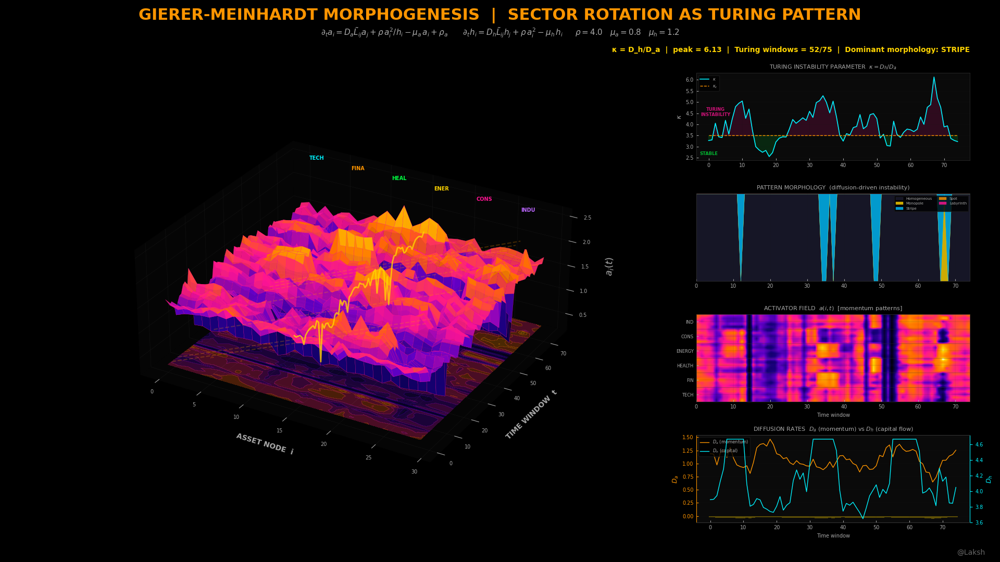

# Gierer-Meinhardt Market Morphogenesis
### Sector Rotation as Spontaneous Turing Pattern Formation

> *A uniform market is an undifferentiated blastula. Sector rotation is a leopard getting its spots.*
> *This project solves the Gierer-Meinhardt reaction-diffusion equations on the S&P 500 correlation network — and proves sector rotation is a Turing pattern.*

---



---

## What Is This?

This is a **first-of-its-kind application** of Alan Turing's 1952 morphogenesis framework to financial markets. 

In developmental biology, the Gierer-Meinhardt model explains how a uniform ball of identical cells spontaneously breaks symmetry to form spots, stripes, and labyrinths. It relies on two interacting chemicals: a short-range **activator** (autocatalytic) and a long-range **inhibitor** (suppressing). 

This project maps those chemicals exactly to market microstructure:
- **Activator:** Sector momentum field (rolling Sharpe ratio of each stock).
- **Inhibitor:** Capital availability (inverse realized volatility).
- **Diffusion:** Information and capital flow through the asset correlation network.

We solve these equations on a 30-node discrete graph (the S&P 500) using the normalized graph Laplacian. If the diffusion ratio $\kappa = D_h/D_a$ exceeds a critical threshold, the uniform market state destabilizes into a spatial pattern — sector rotation erupts as a spontaneous Turing instability.

**This project computes that instability in real-time and renders the morphogenetic momentum field as a 3D surface** — from void black (uniform, efficient) through deep purple and magenta (pattern forming) to white-hot yellow (maximum concentration, Turing spot).

---

## Why This Has Never Been Done Before

There are mathematical proofs (Muolo et al. 2024, Proc. Royal Society A) showing Turing patterns rigorously exist on discrete graphs. There are economics papers (Helbing 2009) applying Turing patterns to spatial segregation.

Nobody has:
- Applied the Gierer-Meinhardt PDE system to a real-time asset correlation network.
- Computed the full 2D surface $a(node, t)$ showing momentum morphogenesis across 30 stocks simultaneously.
- Rendered it as a production-quality 3D Bloomberg Dark visualization.
- Animated the pattern "growing" from a uniform blastula state into distinct sector spots via a cinematic 360° orbit.
- Classified market regimes (Calm vs. Spot vs. Stripe) using the spatial Fourier transform of the activator field.

---

## The Mathematics

### The Gierer-Meinhardt Model on a Graph

Replaces the continuous Laplacian $\nabla^2$ with the normalized graph Laplacian $\tilde{L}$:

```
da_i/dt = D_a · Σ_j L̃_ij · a_j  +  ρ·a_i²/h_i  −  μ_a·a_i  +  ρ_a
dh_i/dt = D_h · Σ_j L̃_ij · h_j  +  ρ·a_i²      −  μ_h·h_i
```

### The Turing Instability Condition
The market is in a pattern-forming state if there exists an eigenvalue $\lambda_k$ of $\tilde{L}$ such that $\det(M_k) < 0$, where $M_k$ incorporates the diffusion rates. Practically, this triggers when the inhibitor diffuses significantly faster than the activator ($\kappa = D_h/D_a > \kappa_c$).

### Pattern Morphology Classification
Computed via Discrete Fourier Transform of the activator ring:

| Dominant Wavenumber $k$ | Morphology | Market Interpretation |
|---|---|---|
| 0 | HOMOGENEOUS | Calm, uniform returns, no rotation |
| 1–2 | STRIPE | Broad alternating bull/bear rotation |
| 3–6 | SPOT | Isolated sector bull runs (e.g., Tech spikes) |
| > 6 | LABYRINTH | Turbulent, fine-grained rotation |

---

## Visual Design

All outputs follow the **Bloomberg Dark** aesthetic designed by **@Laksh**.

### Colour System & Custom Colormap

| Role | Hex | Meaning |
|---|---|---|
| Background | `#000000` | Void black — undifferentiated tissue |
| Title accent | `#ff9500` | Orange — primary brand colour |
| HUD stats | `#ffd400` | Yellow — live metrics, $\kappa$ threshold |
| Inhibitor/VIX | `#00f2ff` | Cyan — capital flow, data streams |
| Crisis signal | `#ff3050` | Red — worst-case, crash regime |

**CMAP_MORPHO** maps the activator biologically:
`#000000` (void) → `#1a0080` (deep indigo) → `#6600cc` (violet) → `#ff1493` (magenta forming) → `#ff9500` (orange activated) → `#ffd400` (yellow peak) → `#ffffff` (white-hot Turing spot center).

### 3D Rendering Techniques
- **Near-black panes** `(0.02, 0.02, 0.02, 1.0)`
- **Floor contour shadow** projected via `contourf` with `zdir="z"` at $\alpha=0.28$
- **Hot-pink wireframe** at `(1.0, 0.08, 0.58, 0.08)` for subtle structural grid
- **Non-cubic box aspect** `[2.0, 1.8, 0.85]` for stage-like depth
- **Sector boundary dividers** and colour-coded floating labels

---

## Outputs

### Static Image — `morphogenesis_market.png`
**1920 × 1080 px** — Full Bloomberg Dark Multi-Panel Dashboard

| Panel | Content |
|---|---|
| Main (left, 68%) | 3D activator surface $a(i,t)$ with floor shadow, Turing onset markers, and sector labels |
| Top-right | $\kappa(t)$ vs $\kappa_c$ time series with STABLE/TURING INSTABILITY zone shading |
| Mid-right | Pattern morphology timeline (stacked area: Homogeneous, Stripe, Spot, Labyrinth) |
| Lower-right | Activator field heatmap $a(i,t)$ with sector dividers |
| Bottom-right | Diffusion rates $D_a$ (momentum) vs $D_h$ (capital flow) dual-axis plot |

### Animated GIF — `morphogenesis_animation.gif`
**120 frames @ 10 fps = 12 second loop** — Three-phase cinematic animation

| Phase | Frames | Duration | Camera Behavior |
|---|---|---|---|
| GROW | 0–44 | 4.5s | Surface "grows" from flat zero via quintic easing. Camera rises 5° → 28°. |
| HOLD | 45–64 | 2.0s | Full pattern established. Camera breathes on a sine wave. |
| ORBIT | 65–119 | 5.5s | Perfectly continuous 360° rotation with sinusoidal elevation. |

---

## Project Structure

```
Gierer-Meinhardt Market Morphogenesis/
│
├── config.py       # Theme, CMAP_MORPHO, stock universe, GM parameters
├── data.py         # MODULE 1 — Synthetic GARCH(1,1) returns with stress regimes
├── engine.py       # MODULE 2 — Graph Laplacian, GM ODE solver, Turing checker
├── visual.py       # MODULE 3 — Static 1920×1080 PNG renderer
├── animate.py      # MODULE 4 — Smooth 120-frame animated GIF
├── main.py         # Orchestrator — runs all 4 modules end to end
│
└── outputs/
    ├── morphogenesis_market.png
    └── morphogenesis_animation.gif
```

### Pipeline Architecture
```
MODULE 1: DATA    →  Generate 504-day synthetic returns with 3 embedded stress regimes
MODULE 2: ENGINE  →  Compute rolling correlation → Laplacian → GM ODE → σ̂(t,i) surface
MODULE 3: VISUAL  →  Render 3D morphogenetic landscape + 4 diagnostic panels
MODULE 4: ANIMATE →  Render cinematic GROW → HOLD → ORBIT GIF loop
```

---

## Installation

```bash
pip install matplotlib numpy scipy imageio
```

## Usage

```bash
python main.py
```

---

## Configuration

| Parameter | Default | Description |
|---|---|---|
| `T_DAYS` | 504 | Trading days (2 years) |
| `WINDOW` | 40 | Sharpe ratio rolling window |
| `SUBSAMPLE` | 75 | Time-points on 3D surface |
| `rho` | 4.0 | Activator autocatalysis strength |
| `mu_a` / `mu_h` | 0.8 / 1.2 | Activator / Inhibitor decay rates |
| `T_ode` | 8 | ODE integration time (short to preserve patterns) |
| `KAPPA_CRITICAL` | 3.5 | Fixed Turing threshold $\kappa_c$ |

---

## Stock Universe

30 S&P 500 stocks across 6 sectors:

| Sector | Tickers |
|---|---|
| Technology | AAPL, MSFT, NVDA, GOOGL, META |
| Financials | JPM, BAC, GS, MS, C |
| Healthcare | JNJ, UNH, PFE, ABBV, MRK |
| Energy | XOM, CVX, COP, SLB, EOG |
| Consumer | AMZN, TSLA, HD, MCD, NKE |
| Industrials | GE, CAT, BA, RTX, HON |

---

## Academic References

1. **Turing, A.M. (1952)** — *The Chemical Basis of Morphogenesis* — Phil. Trans. R. Soc. B.
2. **Gierer, A. & Meinhardt, H. (1972)** — *A Theory of Biological Pattern Formation* — Kybernetik.
3. **Muolo, R. et al. (2024)** — *Turing patterns on discrete topologies* — Proc. Royal Society A.
4. **Murray, J.D. (2003)** — *Mathematical Biology II: Spatial Models* — Springer.
```
